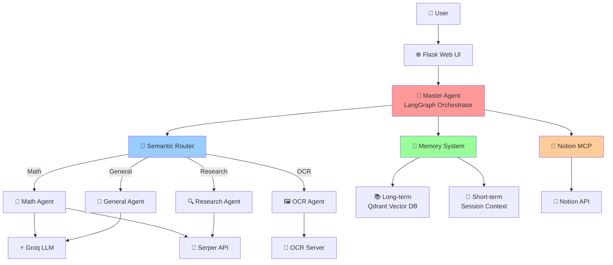

# 🎓 Multi-Agent System for High School Math Learning

> **Hệ thống AI đa tác vụ (Multi-Agent System) hỗ trợ học toán THPT** - Sử dụng LangGraph, Groq LLM, và Notion MCP để giải toán, nghiên cứu, và quản lý kiến thức thông minh.

[](https://www.python.org/downloads/)
[](https://flask.palletsprojects.com/)
[](https://github.com/langchain-ai/langgraph)
[](LICENSE)

---

## 📋 Mục lục

- [Tổng quan](#-tổng-quan)
- [Tính năng nổi bật](#-tính-năng-nổi-bật)
- [Kiến trúc hệ thống](#-kiến-trúc-hệ-thống)
- [Cài đặt](#-cài-đặt)
- [Cấu hình](#️-cấu-hình)
- [Sử dụng](#-sử-dụng)
- [Cấu trúc dự án](#-cấu-trúc-dự-án)
- [API Documentation](#-api-documentation)
- [Troubleshooting](#-troubleshooting)
- [Đóng góp](#-đóng-góp)

---

## 🌟 Tổng quan

Hệ thống Multi-Agent cho học toán THPT là một ứng dụng web AI tiên tiến, được thiết kế để hỗ trợ học sinh và giáo viên trong việc giải quyết các bài toán toán học phức tạp. Hệ thống sử dụng kiến trúc đa tác vụ (multi-agent) với LangGraph để điều phối các agent chuyên biệt, mỗi agent đảm nhận một nhiệm vụ cụ thể.

### 🎯 Mục tiêu

- **Giải toán tự động**: Giải các bài toán toán học từ cơ bản đến nâng cao với lời giải chi tiết từng bước
- **Nghiên cứu thông minh**: Tìm kiếm và tổng hợp thông tin từ web để hỗ trợ học tập
- **Quản lý kiến thức**: Tích hợp Notion để lưu trữ và quản lý bài tập, lời giải
- **Bộ nhớ ngữ cảnh**: Ghi nhớ các bài toán đã giải để cải thiện hiệu suất

---

## ✨ Tính năng nổi bật

### 🧠 1. Định tuyến thông minh (Smart Routing)

- **Semantic Router**: Phân tích ý định người dùng bằng embeddings và từ khóa
- **Tự động phân loại**: Chuyển tiếp yêu cầu đến agent phù hợp (Math, Research, OCR, General)
- **Fallback an toàn**: Xử lý các trường hợp không xác định được ý định
- **Điểm tin cậy**: Đánh giá độ chắc chắn của việc phân loại

### 🧮 2. Math Agent - Chuyên gia giải toán

- **Giải toán từng bước**: Lời giải chi tiết, dễ hiểu
- **Hỗ trợ LaTeX**: Hiển thị công thức toán học đẹp mắt với MathJax
- **Web Research**: Tự động tìm kiếm tài liệu tham khảo từ Google Scholar
- **Nhiều loại bài toán**: Đại số, giải tích, hình học, xác suất thống kê
- **Tự sửa lỗi**: Phát hiện và sửa các placeholder LaTeX không hợp lệ

### 🔍 3. Research Agent - Nghiên cứu & Tra cứu

- **Tìm kiếm web**: Sử dụng Serper API để tìm kiếm thông tin
- **Tổng hợp thông tin**: Kết hợp nhiều nguồn để đưa ra câu trả lời toàn diện
- **Trích dẫn nguồn**: Liệt kê các nguồn tham khảo đáng tin cậy
- **Lưu trữ nghiên cứu**: Lưu kết quả vào bộ nhớ dài hạn

### 📝 4. Tích hợp Notion (MCP - Model Context Protocol)

- **Đọc đề bài**: Lấy bài toán trực tiếp từ Notion Database/Page
- **Lưu lời giải**: Ghi kết quả và lịch sử chat vào Notion
- **Quản lý tài liệu**: Tạo, cập nhật, tìm kiếm pages và databases
- **Markdown hỗ trợ**: Chuyển đổi markdown sang Notion blocks
- **LaTeX trong Notion**: Tự động chuyển đổi công thức LaTeX

### 💾 5. Hệ thống bộ nhớ hai tầng

#### Bộ nhớ dài hạn (Long-term Memory)
- **Vector Database**: Sử dụng Qdrant để lưu trữ và tìm kiếm ngữ nghĩa
- **Phân loại kiến thức**: Lưu trữ theo loại (math_solution, research, knowledge)
- **Tìm kiếm tương tự**: Truy xuất các bài toán đã giải tương tự
- **Đánh giá độ quan trọng**: Ưu tiên lưu trữ thông tin quan trọng

#### Bộ nhớ ngắn hạn (Short-term Memory)
- **Ngữ cảnh hội thoại**: Duy trì ngữ cảnh trong phiên làm việc
- **Cách ly session**: Mỗi session có bộ nhớ riêng
- **Giới hạn kích thước**: Tự động quản lý để tránh quá tải

### 🖼️ 6. OCR Agent - Xử lý hình ảnh

- **Nhận dạng văn bản**: Trích xuất text từ ảnh bài toán
- **Hỗ trợ LaTeX**: Nhận dạng công thức toán học
- **Lưu vào Notion**: Tự động lưu kết quả OCR
- **Nhiều định dạng**: Hỗ trợ PDF, PNG, JPG, JPEG

### 🌐 7. Giao diện Web hiện đại

- **Chat realtime**: Giao diện chat mượt mà, responsive
- **Hiển thị LaTeX**: Render công thức toán học với MathJax
- **Quản lý Notion**: Panel kết nối và quản lý Notion resources
- **Upload file**: Kéo thả file để OCR
- **Trace execution**: Theo dõi quá trình xử lý của agent
- **Multi-session**: Hỗ trợ nhiều phiên làm việc đồng thời

---

## 🏗️ Kiến trúc hệ thống



### Luồng xử lý chính

1. **User Input** → Flask Web UI nhận yêu cầu
2. **Master Agent** → Khởi tạo state và context
3. **Semantic Router** → Phân tích ý định và chọn agent
4. **Specialized Agent** → Xử lý yêu cầu cụ thể
5. **Memory Integration** → Lưu/truy xuất kiến thức
6. **Response** → Trả kết quả về UI với LaTeX rendering

---

## 📦 Cài đặt

### Yêu cầu hệ thống

- **Python**: 3.10 trở lên
- **Hệ điều hành**: Windows, macOS, hoặc Linux
- **RAM**: Tối thiểu 4GB (khuyến nghị 8GB)
- **Kết nối Internet**: Cần thiết cho API calls

### Các bước cài đặt

#### 1. Clone repository

```bash
git clone https://github.com/yourusername/MultiAgent_System_for_HighSchool_MathLearning.git
cd MultiAgent_System_for_HighSchool_MathLearning
```

#### 2. Tạo môi trường ảo (khuyên dùng)

**Windows:**
```bash
python -m venv .venv
.\.venv\Scripts\activate
```

**macOS/Linux:**
```bash
python -m venv .venv
source .venv/bin/activate
```

#### 3. Cài đặt dependencies

```bash
pip install -r requirements.txt
```

**Dependencies chính:**
- `langgraph>=0.2.0` - Agent orchestration
- `groq>=0.11.0` - LLM provider
- `flask>=3.0.0` - Web framework
- `sentence-transformers>=2.2.2` - Embeddings
- `qdrant-client` - Vector database
- `notion-client` - Notion integration
- `aiohttp` - Async HTTP
- `beautifulsoup4` - HTML parsing

#### 4. Cài đặt thêm (nếu cần)

```bash
# Qdrant client
pip install qdrant-client

# Google Generative AI
pip install google-generativeai

# Notion client
pip install notion-client

# Logging
pip install loguru

# MCP SDK
pip install mcp
```

---

## ⚙️ Cấu hình

### 1. Tạo file `.env`

Sao chép file `.env.example` thành `.env`:

```bash
cp .env.example .env
```

### 2. Cấu hình API Keys

Mở file `.env` và điền các API keys:

```ini
# --- LLM Provider (BẮT BUỘC) ---
GROQ_API_KEY=gsk_your_groq_api_key_here

# --- Google Generative AI (TÙY CHỌN) ---
GOOGLE_API_KEY_1=AIza_your_google_api_key_here
# GOOGLE_API_KEY_2=  # Thêm nhiều keys để xoay vòng
# GOOGLE_API_KEY_3=

# --- Notion Integration (BẮT BUỘC cho tính năng Notion) ---
NOTION_TOKEN=secret_your_notion_integration_token_here

# --- Web Search (TÙY CHỌN) ---
SERPER_API_KEY=your_serper_api_key_here

# --- Flask Security ---
FLASK_SECRET_KEY=your-random-secret-key-change-in-production
```

### 3. Lấy API Keys

#### Groq API Key (BẮT BUỘC)
1. Truy cập [https://console.groq.com](https://console.groq.com)
2. Đăng ký/Đăng nhập
3. Vào **API Keys** → **Create API Key**
4. Copy key và dán vào `.env`

#### Notion Integration Token (Cho tính năng Notion)
1. Truy cập [https://www.notion.so/my-integrations](https://www.notion.so/my-integrations)
2. Click **+ New integration**
3. Đặt tên (vd: "Math Learning Bot")
4. Chọn workspace
5. Copy **Internal Integration Token**
6. **Quan trọng**: Share page/database với integration:
   - Mở page/database trong Notion
   - Click **Share** → Invite integration

#### Serper API Key (Tùy chọn - cho Research Agent)
1. Truy cập [https://serper.dev](https://serper.dev)
2. Đăng ký tài khoản
3. Copy API key từ dashboard

#### Google API Key (Tùy chọn)
1. Truy cập [Google AI Studio](https://makersuite.google.com/app/apikey)
2. Tạo API key
3. Copy và dán vào `.env`

### 4. Cấu hình Qdrant (Bộ nhớ Vector)

Hệ thống sử dụng Qdrant ở chế độ **in-memory** mặc định (dữ liệu mất khi tắt app).

**Để lưu trữ lâu dài**, chỉnh sửa `Memory/qdrant_store.py`:

```python
# Thay đổi từ in-memory sang local storage
self.client = QdrantClient(path="./qdrant_data")  # Lưu vào thư mục local
```

Hoặc sử dụng Qdrant server:

```python
self.client = QdrantClient(host="localhost", port=6333)
```

---

## 🚀 Sử dụng

### Khởi chạy ứng dụng Web

```bash
python flask_app.py
```

Ứng dụng sẽ chạy tại: **http://localhost:5000**

### Sử dụng giao diện Web

#### 1. Chat cơ bản

Nhập câu hỏi vào ô chat:

```
Công thức tính diện tích hình tròn là gì?
```

```
Giải phương trình: 2x + 5 = 15
```

```
Tìm hiểu về định lý Pythagoras
```

#### 2. Giải toán

Hệ thống tự động nhận diện bài toán và gọi Math Agent:

```
Giải hệ phương trình:
x + y = 5
x - y = 1
```

Kết quả sẽ hiển thị:
- Lời giải từng bước
- Công thức LaTeX được render đẹp
- Tài liệu tham khảo (nếu có)

#### 3. Kết nối Notion

**Bước 1**: Vào **Settings** → **Integrations**

**Bước 2**: Nhập Notion Token (nếu chưa có trong `.env`)

**Bước 3**: Click **Connect Notion**

**Bước 4**: Chọn Page/Database từ danh sách

**Bước 5**: Sử dụng:

```
Đọc bài toán từ Notion page này
```

```
Lưu lời giải này vào Notion
```

#### 4. Upload ảnh để OCR

**Cách 1**: Kéo thả file vào vùng upload

**Cách 2**: Click nút **Upload** và chọn file

Hỗ trợ: PDF, PNG, JPG, JPEG (max 20MB)

Kết quả OCR sẽ tự động lưu vào Notion (nếu đã kết nối)

#### 5. Quản lý Session

- **New Session**: Tạo phiên làm việc mới
- **Clear Chat**: Xóa lịch sử chat hiện tại
- **View Memory**: Xem các bài toán đã lưu

### Sử dụng CLI (Dành cho Developer)

#### Test Math Agent

```bash
python Agent/math_agent.py --problem "Giải phương trình x^2 - 5x + 6 = 0"
```

#### Test Master Agent

```bash
python Agent/master_agent.py --prompt "Tìm hiểu về số nguyên tố"
```

#### Test Notion MCP

```bash
cd MCP
python test.py
```

---

## 📁 Cấu trúc dự án

```
MultiAgent_System_for_HighSchool_MathLearning/
│
├── 📄 flask_app.py                 # [ENTRY POINT] Flask web application
├── 📄 config.py                    # Cấu hình hệ thống
├── 📄 requirements.txt             # Python dependencies
├── 📄 .env.example                 # Template cho environment variables
├── 📄 .env                         # Environment variables (không commit)
│
├── 📁 Agent/                       # Các agent chuyên biệt
│   ├── 📄 master_agent.py          # Master Agent - Điều phối LangGraph
│   ├── 📄 math_agent.py            # Math Agent - Giải toán
│   ├── 📄 research_agent.py        # Research Agent - Nghiên cứu
│   ├── 📄 ocr.py                   # OCR Agent - Xử lý ảnh
│   ├── 📄 agent.py                 # Base agent class
│   └── 📁 tools/                   # Công cụ hỗ trợ
│       ├── 📄 semantic_router.py   # Bộ định tuyến ngữ nghĩa
│       ├── 📄 llm_router.py        # LLM-based routing
│       └── 📄 serper_tool.py       # Serper API integration
│
├── 📁 MCP/                         # Notion MCP Integration
│   ├── 📄 notion_mcp_client.py     # Notion MCP client
│   ├── 📄 mcp_server.py            # MCP server
│   ├── 📄 markdown_converter.py    # Markdown ↔ Notion blocks
│   ├── 📄 main.py                  # MCP entry point
│   └── 📄 test.py                  # MCP testing
│
├── 📁 Memory/                      # Hệ thống bộ nhớ
│   ├── 📄 long_term.py             # Bộ nhớ dài hạn (Qdrant)
│   ├── 📄 short_term.py            # Bộ nhớ ngắn hạn (Session)
│   └── 📄 qdrant_store.py          # Qdrant vector store
│
├── 📁 OCR/                         # OCR components
│   ├── 📄 ocr_model.py             # OCR model interface
│   ├── 📄 async_ocr_client.py      # Async OCR client
│   └── 📄 pdf.py                   # PDF processing
│
├── 📁 templates/                   # HTML templates
│   └── 📄 index.html               # Main web interface
│
├── 📁 static/                      # Static assets
│   ├── 📁 css/                     # Stylesheets
│   ├── 📁 js/                      # JavaScript
│   └── 📁 images/                  # Images
│
├── 📁 uploads/                     # Uploaded files (OCR)
├── 📁 data/                        # Data storage
└── 📁 utils/                       # Utility functions
```

---

## 📚 API Documentation

### REST API Endpoints

#### Chat

**POST** `/api/chat`
```json
{
  "prompt": "Giải phương trình x^2 - 4 = 0",
  "session_id": "session-123"
}
```

Response:
```json
{
  "success": true,
  "reply": "Lời giải chi tiết...",
  "trace": [...],
  "session_id": "session-123"
}
```

#### Upload File

**POST** `/api/upload-file`
- Form data: `file` (multipart/form-data)
- Returns: OCR result

#### Notion Integration

**POST** `/api/notion/fetch`
```json
{
  "page_id": "notion-page-id",
  "session_id": "session-123"
}
```

**POST** `/api/notion/update-page`
```json
{
  "page_id": "notion-page-id",
  "content": "Markdown content",
  "mode": "add"  // or "edit"
}
```

#### Memory

**GET** `/api/memory/stats`
- Returns: Memory statistics

**POST** `/api/messages/clear`
- Clears chat history

### Agent API

#### Math Agent

```python
from Agent.math_agent import build_graph, MathAgentState

graph = build_graph().compile()
state = MathAgentState(
    problem_text="Giải x^2 - 4 = 0",
    use_research=True
)
result = await graph.ainvoke(state)
print(result.solution_text)
```

#### Master Agent

```python
from Agent.master_agent import build_master_graph, MasterAgentState

graph = build_master_graph().compile()
state = MasterAgentState(
    user_prompt="Tìm hiểu về số nguyên tố",
    session_id="session-123"
)
result = await graph.ainvoke(state)
print(result.result)
```

---

## 🔧 Troubleshooting

### Lỗi thường gặp

#### 1. `ModuleNotFoundError`

**Nguyên nhân**: Thiếu dependencies hoặc sai đường dẫn

**Giải pháp**:
```bash
# Cài đặt lại dependencies
pip install -r requirements.txt

# Đảm bảo đang ở thư mục gốc
cd MultiAgent_System_for_HighSchool_MathLearning
python flask_app.py
```

#### 2. Notion không kết nối

**Nguyên nhân**: Token không hợp lệ hoặc chưa share page

**Giải pháp**:
1. Kiểm tra `NOTION_TOKEN` trong `.env`
2. Đảm bảo đã share page/database với integration:
   - Mở page trong Notion
   - Click **Share**
   - Invite integration của bạn
3. Restart Flask app

#### 3. LaTeX không hiển thị

**Nguyên nhân**: MathJax chưa load hoặc syntax sai

**Giải pháp**:
1. Kiểm tra kết nối internet (MathJax load từ CDN)
2. Xóa cache trình duyệt
3. Kiểm tra console log trong DevTools

#### 4. OCR không hoạt động

**Nguyên nhân**: OCR server không online

**Giải pháp**:
1. Kiểm tra URL OCR server trong `Agent/ocr.py`
2. Đảm bảo server đang chạy
3. Kiểm tra kết nối mạng

#### 5. Groq API Error

**Nguyên nhân**: API key sai hoặc hết quota

**Giải pháp**:
1. Kiểm tra `GROQ_API_KEY` trong `.env`
2. Verify key tại [Groq Console](https://console.groq.com)
3. Kiểm tra usage limits

#### 6. Qdrant Memory Error

**Nguyên nhân**: Qdrant client không khởi tạo được

**Giải pháp**:
```bash
# Cài đặt lại Qdrant client
pip install --upgrade qdrant-client

# Xóa dữ liệu cũ (nếu dùng local storage)
rm -rf ./qdrant_data
```

#### 7. Port 5000 đã được sử dụng

**Giải pháp**:
```bash
# Thay đổi port trong flask_app.py
# Hoặc kill process đang dùng port 5000
# Windows:
netstat -ano | findstr :5000
taskkill /PID <PID> /F

# macOS/Linux:
lsof -ti:5000 | xargs kill -9
```

### Debug Mode

Bật debug mode để xem chi tiết lỗi:

```python
# Trong flask_app.py
if __name__ == "__main__":
    app.run(debug=True, host="0.0.0.0", port=5000)
```

### Logging

Xem logs chi tiết:

```python
import logging
logging.basicConfig(level=logging.DEBUG)
```

---

## 🤝 Đóng góp

Chúng tôi hoan nghênh mọi đóng góp! Vui lòng:

1. Fork repository
2. Tạo branch mới (`git checkout -b feature/AmazingFeature`)
3. Commit changes (`git commit -m 'Add some AmazingFeature'`)
4. Push to branch (`git push origin feature/AmazingFeature`)
5. Mở Pull Request

### Coding Standards

- Sử dụng Python 3.10+ type hints
- Follow PEP 8 style guide
- Viết docstrings cho functions/classes
- Thêm tests cho features mới

---

## 📄 License

Distributed under the MIT License. See `LICENSE` for more information.

---

## 👥 Authors

- **Your Name** - *Initial work* - [YourGitHub](https://github.com/yourusername)

---

## 🙏 Acknowledgments

- [LangGraph](https://github.com/langchain-ai/langgraph) - Agent orchestration framework
- [Groq](https://groq.com) - Fast LLM inference
- [Notion](https://notion.so) - Knowledge management
- [Qdrant](https://qdrant.tech) - Vector database
- [Flask](https://flask.palletsprojects.com) - Web framework
- [Serper](https://serper.dev) - Search API

---

## 🗺️ Roadmap

- [ ] Hỗ trợ thêm ngôn ngữ (English, etc.)
- [ ] Tích hợp thêm LLM providers (OpenAI, Anthropic)
- [ ] Mobile app (React Native)
- [ ] Collaborative learning features
- [ ] Gamification elements
- [ ] Advanced analytics dashboard
- [ ] Voice input/output
- [ ] Offline mode

---

<div align="center">

**⭐ Nếu project hữu ích, hãy cho chúng tôi một star! ⭐**


</div>
